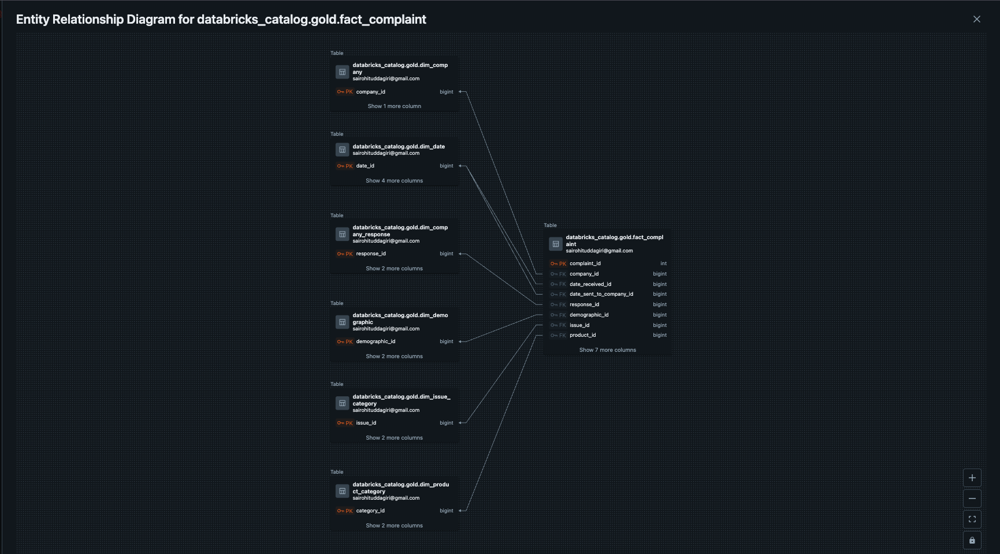
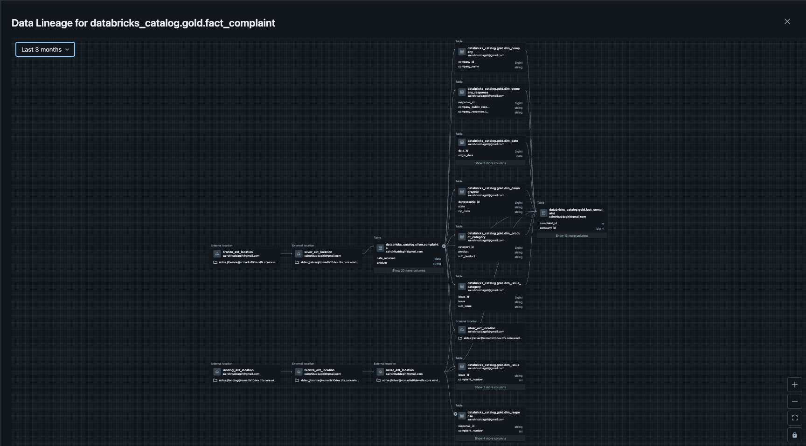

# Gold Layer Data Catalog

### Overview
The Gold layer implements a dimensional data model (star schema) optimized for analytical queries and business intelligence reporting. This layer contains business-ready data with proper dimensional modeling, including fact tables for transactional data and dimension tables for descriptive attributes.

### Table Catalog Location
- **Unity Catalog**: `databricks_catalog.gold`
- **Storage Location**: `abfss://gold@rcmadls10dev.dfs.core.windows.net/`
- **Storage Format**: `Delta`

---

## Fact Tables

### fact_consumer_complaints
**Purpose**: Central fact table storing consumer complaint transactions with foreign keys to dimension tables.

**Business Context**: Each record represents a single consumer complaint submitted to the CFPB, with measures for analysis and foreign keys linking to descriptive dimensions.

| Column Name | Data Type | Description | Business Rules | Sample Values |
|---|---|---|---|---|
| `complaint_id` | INT | Primary key, unique identifier for each complaint | NOT NULL, UNIQUE | 123456, 789012 |
| `company_id` | BIGINT | Foreign key to dim_company | NOT NULL, References dim_company.company_id | 1, 2, 3 |
| `response_id` | BIGINT | Foreign key to dim_company_response | NOT NULL, References dim_company_response.response_id | 1, 2, 3 |
| `product_id` | BIGINT | Foreign key to dim_product_category | NOT NULL, References dim_product_category.category_id | 1, 2, 3 |
| `issue_id` | BIGINT | Foreign key to dim_issue_category | NOT NULL, References dim_issue_category.issue_id | 1, 2, 3 |
| `demographic_id` | BIGINT | Foreign key to dim_demographic | NOT NULL, References dim_demographic.demographic_id | 1, 2, 3 |
| `date_received_id` | BIGINT | Foreign key to dim_date (complaint received date) | NOT NULL, References dim_date.date_id | 20240101, 20240102 |
| `date_sent_id` | BIGINT | Foreign key to dim_date (complaint sent to company date) | NOT NULL, References dim_date.date_id | 20240103, NULL |
| `timely_response` | BOOLEAN | Whether company provided timely response | NOT NULL | true, false |
| `consumer_complaint_narrative` | STRING | description of the complaint | NULLABLE | |
| `consumer_consent_provided` | STRING | Identifies whether the consumer opted in to publish their complaint narrative. | NULLABLE | |
| `submitted_via` | STRING | How the complaint was submitted to the CFPB | NOT NULL | web |
| `resolved` | BOOLEAN | Whether company resolved the complaint | NOT NULL | true, false |
| `complaint_age` | INT | Number of days the complaint is active for | NOT NULL, DEFAULT 1 | 1 |
| `last_modified_date` | TIMESTAMP | Record last update timestamp | NOT NULL | 2024-01-01 10:30:00 |

**Table Properties**:
- **Storage Format**: Delta Lake
- **Partitioning**: Partitioned by `date_received_id` (monthly partitions)
- **Optimization**: Z-ORDERED by (`company_id`, `product_id`, `date_received_id`)
- **Row Count**: ~500K records (historical data from 2020-2024)
- **Update Frequency**: Daily incremental loads

**Primary Key**: `complaint_id`

**Foreign Key Relationships**:
- `company_id` → `dim_company.company_id`
- `response_id` → `dim_company_response.response_id`
- `product_id` → `dim_product_category.category_id`
- `issue_id` → `dim_issue_category.issue_id`
- `demographic_id` → `dim_demographic.demographic_id`
- `date_received_id` → `dim_date.date_id`
- `date_sent_id` → `dim_date.date_id`

---

## Dimension Tables

### dim_company
**Purpose**: Contains company information for organizations that received consumer complaints.

**SCD**: Enabled Change Data Feed - Historical changes are tracked.

| Column Name | Data Type | Description | Business Rules | Sample Values |
|---|---|---|---|---|
| `company_id` | BIGINT | Surrogate key (auto-generated) | NOT NULL, PRIMARY KEY, IDENTITY | 1, 2, 3 |
| `company_name` | STRING | Official company name | NOT NULL | "Bank of America", "Wells Fargo" |

---

### dim_company_response
**Purpose**: Contains company response provided to public and to consumer for a received consumer complaints.

**SCD**: Enabled Change Data Feed - Historical changes are tracked.

| Column Name | Data Type | Description | Business Rules | Sample Values |
|---|---|---|---|---|
| `response_id` | BIGINT | Surrogate key (auto-generated) | NOT NULL, PRIMARY KEY, IDENTITY | 1, 2, 3 |
| `company_public_response` | STRING | company response to public | NOT NULL | "Company believes complaint is the result of an isolated error" |
| `company_response_to_consumer` | STRING | company response to consumer | NOT NULL | "Closed with explanation" |

---

### dim_product_category
**Purpose**: Product categories and subcategories for financial products related to complaints.

**SCD**: Enabled Change Data Feed - Historical changes are tracked.

| Column Name | Data Type | Description | Business Rules | Sample Values |
|---|---|---|---|---|
| `category_id` | BIGINT | Surrogate key (auto-generated) | NOT NULL, PRIMARY KEY, IDENTITY | 1, 2, 3 |
| `product` | STRING | Main product category | NOT NULL | "Credit card", "Mortgage", "Checking account" |
| `sub_product` | STRING | Product subcategory | NULLABLE | "General-purpose credit card", "Conventional home mortgage" |

---

### dim_issue_category
**Purpose**: Complaint issues and sub-issues for categorizing customer problems.

**SCD**: Enabled Change Data Feed - Historical changes are tracked.

| Column Name | Data Type | Description | Business Rules | Sample Values |
|---|---|---|---|---|
| `issue_id` | BIGINT | Surrogate key (auto-generated) | NOT NULL, PRIMARY KEY, IDENTITY | 1, 2, 3 |
| `issue` | STRING | Main issue category | NOT NULL | "Billing disputes", "Account opening", "Payment processing" |
| `sub_issue` | STRING | Specific issue subcategory | NULLABLE | "Credit card company isn't resolving a dispute", "Unable to open account" |

---

### dim_demographic
**Purpose**: Geographic information for complaint locations (state, ZIP code level).

**SCD**: Enabled Change Data Feed - Historical changes are tracked.

| Column Name | Data Type | Description | Business Rules | Sample Values |
|---|---|---|---|---|
| `demographic_id` | BIGINT | Surrogate key (auto-generated) | NOT NULL, PRIMARY KEY, IDENTITY | 1, 2, 3 |
| `state` | STRING | US state abbreviation | NOT NULL | "CA", "NY", "TX" |
| `zip_code` | STRING | ZIP code (5-digit) | NULLABLE | "90210", "10001", "75201" |

---

### dim_date
**Purpose**: Date dimension for time-based analysis and reporting.

| Column Name | Data Type | Description | Business Rules | Sample Values |
|---|---|---|---|---|
| `date_id` | INT | Surrogate key in YYYYMMDD format | NOT NULL, PRIMARY KEY | 20240101, 20240102 |
| `origin_date` | DATE | Actual date value | NOT NULL, UNIQUE | 2024-01-01, 2024-01-02 |
| `year` | INT | Calendar year | NOT NULL | 2024, 2023 |
| `month` | INT | Calendar month (1-12) | NOT NULL | 1, 2, 12 |
| `day` | INT | Day of week (1=Sunday, 7=Saturday) | NOT NULL | 1, 2, 7 |

---

## Entity Relationship Between Fact and Dimensions (Star Schema)

---

## Data Lineage

### Source to Gold Layer Mapping

### Transformation Rules

**fact_complaint**:
- Source: `silver.complaint`
- Transformation: Join with dimension tables to get surrogate keys
- Grain: One record per complaint

**dim_company**:
- Source: `silver.complaint.company`
- Transformation: Distinct company names with Delta Change Data Feed Enabled
- Grain: One record per company

**dim_company_response**:
- Source: `silver.complaint.company_public_response`, `silver.complaint.company_response_to_consumer`
- Transformation: Distinct company responses with Delta Change Data Feed Enabled
- Grain: One record per company response

**dim_product_category**:
- Source: `silver.complaint.product`, `silver.complaint.sub_product`
- Transformation: Distinct product combinations with Delta Change Data Feed Enabled
- Grain: One record per product/sub-product combination

**dim_issue_category**:
- Source: `silver.complaint.issue`, `silver.complaint.sub_issue`
- Transformation: Distinct issue combinations with Delta Change Data Feed Enabled
- Grain: One record per issue/sub-issue combination

**dim_demographic**:
- Source: `silver.complaint.state`, `silver.complaint.zip_code`
- Transformation: Distinct state and zip code combinations with Delta Change Data Feed Enabled
- Grain: One record per state/ZIP code combination

---

## Data Quality Rules

### Fact Table Validation
- All foreign keys must exist in corresponding dimension tables
- `complaint_count` must equal 1 for all records
- `response_days` must be >= 0 when not null
- No duplicate `complaint_id` values

### Dimension Table Validation
- All primary keys must be unique and not null
- Company dimension: Only one current record per company
- Date dimension: Continuous date range without gaps
- Demographic dimension: Valid state codes only

### Referential Integrity
- All fact table foreign keys must have corresponding dimension records
- Dimension tables must not have unused surrogate keys (optional)

---

## Dimensional Change Tracking Query

`DESCRIBE HISTORY databricks_catalog.gold.dim_company_response;`

`SELECT * FROM table_changes('databricks_catalog.gold.dim_company_response', 3);`

---

## Performance Optimization

### Partitioning Strategy
- **fact_consumer_complaints**: Partitioned by `date_received_id` (monthly partitions)
- **dim_company**: No partitioning (small table)
- Other dimensions: No partitioning (relatively small tables)

### Indexing and Clustering
- **Z-ORDER Clustering**: Applied to frequently joined columns

### Best Practices
1. Always join fact tables with dimension tables using surrogate keys
2. Filter on dimension attributes rather than fact table columns when possible
3. Use the date dimension for all time-based filtering and grouping
4. Consider query performance when selecting multiple dimensions

---

*Last Updated: [06-15-2025]*  
*Version: 1.0* 